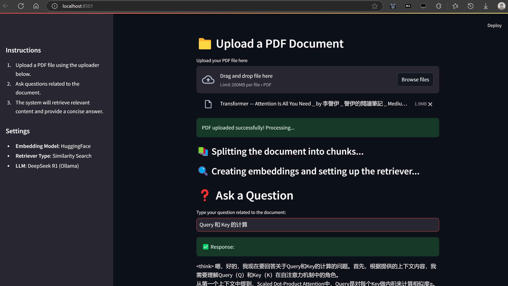
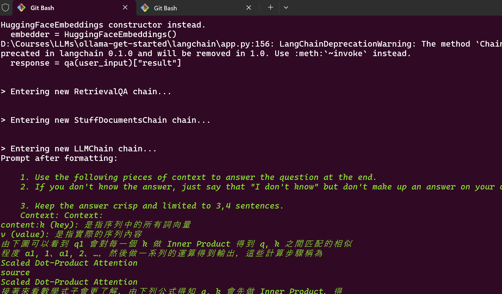

# RAG (Retrieval-Augmented Generation) Services with Langchain

First borrow code from [blog](https://dev.to/ajmal_hasan/setting-up-ollama-running-deepseek-r1-locally-for-a-powerful-rag-system-4pd4) and [code](https://github.com/Ajmal0197/DeepseekOllamaRag/blob/main/app.py).

## Featured

* Integration with Ollama
* Run along side [DeepSeek](https://github.com/hailiang-wang/llm-get-started/tree/master/002_deepseek)
* Enhance Chinese Processing with [Synonyms](https://github.com/chatopera/Synonyms/) for recalling.

## Start

First, make sure works `DeepSeek R1` above are done, because Langchain RAG App below depends on `DeepSeek R1`.

```
cd 003_langchain
pip install -r requirements.txt
streamlit run app.py
```



Trace log - 

