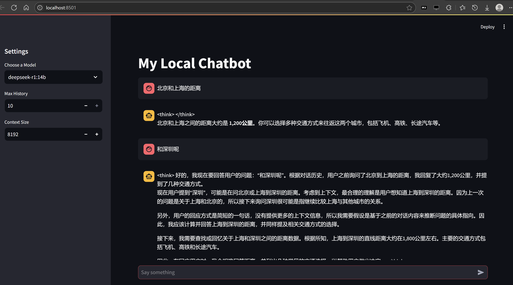

# chatbot with LangChain

Borrow code from [Shamimw@medium.com](https://medium.com/@Shamimw/building-a-local-ai-chatbot-using-streamlit-langchain-and-ollama-484b82083988) originally.

## Chat

* https://python.langchain.com/docs/tutorials/chatbot/
* https://python.langchain.com/api_reference/ollama/chat_models/langchain_ollama.chat_models.ChatOllama.html#langchain_ollama.chat_models.ChatOllama


## RAG

* https://python.langchain.com/docs/tutorials/rag/
* https://python.langchain.com/docs/tutorials/qa_chat_history/
* https://python.langchain.com/docs/tutorials/agents/


## Start

First, install ollama, next, run `ollama pull deepseek-r1:14b`

At last, run
```
./start.sh
```

