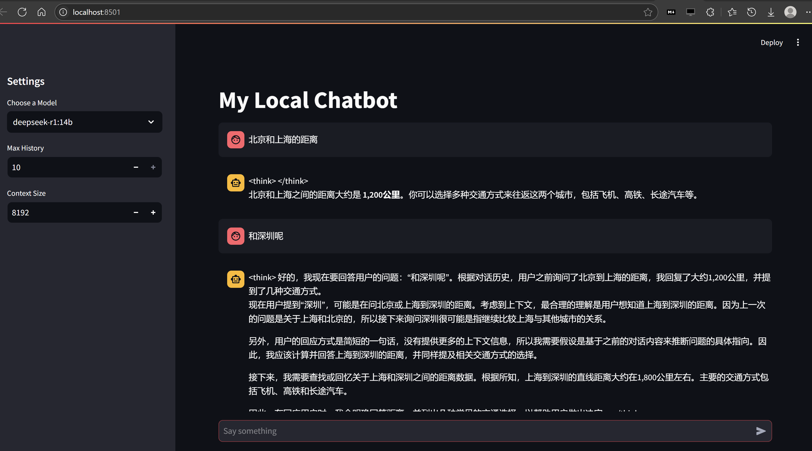

# Agent built with LangChain

[By themselves, language models can't take actions - they just output text. A big use case for LangChain is creating agents. Agents are systems that use LLMs as reasoning engines to determine which actions to take and the inputs necessary to perform the action. After executing actions, the results can be fed back into the LLM to determine whether more actions are needed, or whether it is okay to finish. This is often achieved via tool-calling.](https://python.langchain.com/docs/tutorials/agents/)

## RAG & Agent

* https://gaodalie.substack.com/p/langchain-mcp-rag-ollama-the-key
* https://python.langchain.com/docs/tutorials/rag/
* https://python.langchain.com/docs/tutorials/qa_chat_history/
* https://python.langchain.com/docs/tutorials/agents/


## Start

First, install ollama, next, run `ollama pull mistral-nemo:latest`

At last, run
```
./start.sh
```

