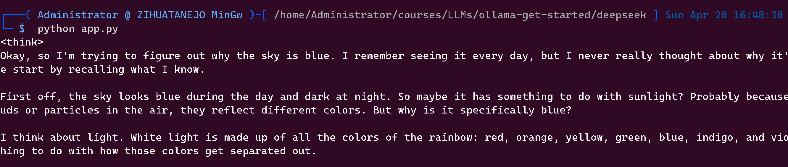
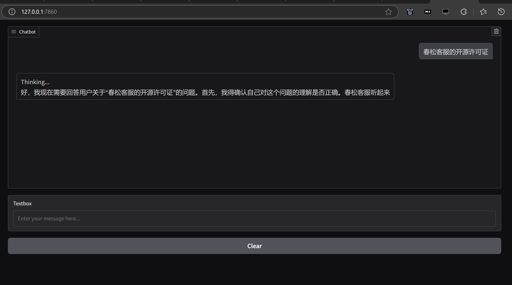

# ollama-get-started
Get started with Ollama for LLMs.

## DeepSeek R1

https://ollama.com/library/deepseek-r1


```
cd deepseek
pip install -r requirement.txt
python app.py
# Run Gradio to chat in Browser.
```

### Chat via Console



### Chat via Browser



## FAQs

* [ollama FAQs](https://github.com/ollama/ollama/blob/main/docs/faq.md)
* [ollama Community](https://discord.com/channels/1128867683291627614/1211804431340019753)